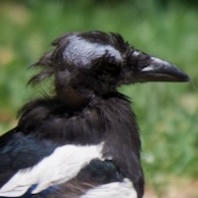

# Beaker

[](https://github.com/ericphanson/beaker/actions/workflows/beaker-ci.yml)

A tool to apply ML models to bird images. `beaker detect` detects and crops bird objects (bird, head, eyes, beak) using a finetuned YOLOv8n model trained on the CUB-200-2011 dataset, and `beaker cutout` performs background removal using an off-the-shelf model.

## 1. License & Usage

This is for the model used by `beaker detect`.

| Origin | Original terms | What that means for these weights |
|--------|----------------|-----------------------------------|
| **Dataset:** Caltech-UCSD Birds-200-2011 | "Images are for **non-commercial research and educational purposes only**." | ➜ **No commercial use** of the weights or any derivative work. |
| **Training code:** Ultralytics YOLOv8 | Source and official models released under **GNU AGPL-3.0** | ➜ If you **redistribute or serve** the weights, you must also release the full source & weights **under AGPL-3.0**. |

### Summary
Because the weights were trained on CUB images *and* with AGPL-licensed code, they are provided **solely for non-commercial research/education** under **AGPL-3.0**.
Commercial use would require **separate rights to the images** *and* a **non-AGPL licence from Ultralytics**.

*No warranty. Provided "as is."*

## 2. Quick Start

To install, you'll need [`cargo`](https://doc.rust-lang.org/cargo/getting-started/installation.html). Then run
```bash
cargo install --git https://github.com/ericphanson/beaker
```

to compile and install the binary. I don't have an apple developer account so I can't codesign binaries, so this seems like the most reliable way to get a working binary.

### Usage examples

```bash
beaker --help
beaker version

beaker detect --crop=head example.jpg
beaker detect --bounding-box example.jpg
beaker detect --crop=head --device cpu example.jpg
beaker detect --crop=head *.jpg
beaker detect --crop=head my_folder

# Multi-class detection and cropping
beaker detect --crop=head,bird example.jpg
beaker detect --crop=all example.jpg

# Basic background removal
beaker cutout image.jpg

# Advanced alpha matting
beaker cutout --alpha-matting --save-mask image.jpg

# White background replacement
beaker cutout --background-color "255,255,255,255" image.jpg
```

For example, the example image


can be processed with

```sh
beaker detect --crop=head example.jpg
```

yielding the output crop saved as `example_crop_head.jpg`:



**Limitations:**
- Works best on clear, well-lit images of single birds
- False positives possible on non-bird objects. The detection model has _only_ been finetuned on bird images.

## 3. Detection Model Card

Here we describe the model used by `beaker detect`, which has been finetuned to detect bird objects including heads. The model used by `beaker cutout` is `isnet-general-use` and has not been finetuned.

- **Architecture:** YOLOv8n, ~3M parameters
- **Finetuning dataset:** CUB-200-2011 bird parts (head regions only). ~6k train images, ~6k validation images
- **Classes:** 1 (bird_head)
- **Input size:** 640×640 pixels

Here are the validation metrics from the [v1](https://github.com/ericphanson/beaker/releases/tag/bird-head-detector-v1.0.0) model currently used by `beaker`:

| **Precision** | **Recall** | **mAP@0.5** | **mAP@0.5:0.95** | **Val Box Loss** | **Val CLS Loss** | **Val DFL Loss** |
|--------------:|-----------:|------------:|-----------------:|-----------------:|-----------------:|-----------------:|
| 0.9771        | 0.9646     | 0.9851      | 0.6779           | 1.1704           | 0.4518           | 1.2195           |

- **Precision**: Proportion of predicted bird heads that are correct (≈ 97.7%).
- **Recall**: Proportion of actual bird heads detected (≈ 96.5%).
- **mAP@0.5**: Mean Average Precision at IoU threshold 0.5 — primary object detection metric; high (≈ 98.5%).
- **mAP@0.5:0.95**: Averaged mAP over IoU thresholds from 0.5 to 0.95 (in steps of 0.05); more stringent (≈ 67.8%).
- **Box Loss**: Localization loss – how well bounding boxes fit bird heads.
- **CLS Loss**: Classification loss – low, as expected for single-class task.
- **DFL Loss**: Distribution Focal Loss – helps with bounding box quality.

## 4. Development & Training

### 4.1. Data

Download and prepare the CUB-200-2011 dataset:

1. **Download CUB-200-2011:**
   ```bash
   # Download from Caltech (requires accepting terms)
   # http://www.vision.caltech.edu/visipedia/CUB-200-2011.html
   # Extract to: data/CUB_200_2011/
   ```

2. **Convert to YOLO format:**
   ```bash
   cd training
   uv run beaker-convert
   ```

   This creates `data/yolo/` with train/val splits and YOLO-format labels. The conversion extracts head-related parts (beak, crown, forehead, eyes, nape, throat) and creates bounding boxes around them.

### 4.2. Install Dependencies

```bash
# Install all dependencies (training + preprocessing + release tools)
cd training
uv sync --extra dev
```

Requires Python 3.12+. On M1/M2 Macs, verify MPS is available:
```bash
cd training
uv run python -c "import torch; print(f'MPS available: {torch.backends.mps.is_available()}')"
```

### 4.3. Training

If using [comet](https://www.comet.com/), update [`.envrc`](./.envrc) to set the `COMET_WORKSPACE` variable and add your API key to your environment (`export COMET_API_KEY="your-api-key"`).

**Basic training:**
```bash
cd training
uv run beaker-train
```

**Debug mode** (faster, less data):
Edit `training/train.py` and set `'debug_run': True` in `TRAINING_CONFIG`.

**Training notes:**
- Expects ~2-4 hours on M1 MacBook Pro for full training
- Model converges quickly but benefits from longer training
- Batch size may need adjustment based on available memory
- No hyperparameter tuning has been performed

### 4.4. Upload training results as GitHub releases

Create GitHub releases with trained models:

```bash
# Ensure clean repository state
git add . && git commit -m "Update before release"

# Create release
cd training
uv run beaker-upload

# Follow prompts for version number and model selection
```

The script uploads the selected model as `bird-head-detector.pt` along with training artifacts (plots, configs, results) and an ONNX export `bird-head-detector.onnx`.

Note: the `isnet-general-use` model was uploaded using the [`training/upload_cutout.sh`](./training/upload_cutout.sh) which simply copies the ONNX model from [rembg](https://github.com/danielgatis/rembg).

## 5. How to build `beaker` from source

`beaker` is the CLI tool developed in [./beaker](./beaker/) which is used for inference.

```bash
git clone https://github.com/ericphanson/beaker
cd beaker/beaker
cargo build --release
cargo install --path .
```

## 6. Note

The code in this repository was largely written by Claude Sonnet 4 via GitHub copilot.
