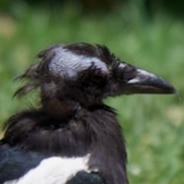

# Beaker

[](https://github.com/ericphanson/beaker/actions/workflows/beaker-ci.yml)

A tool to apply ML models to bird images. `beaker detect` detects and crops bird objects (bird, head, eyes, beak) using a finetuned YOLOv8n model trained on the CUB-200-2011 dataset, and `beaker cutout` performs background removal using an off-the-shelf model.

## 1. License & Usage

This is for the model used by `beaker detect`.

| Origin | Original terms | What that means for these weights |
|--------|----------------|-----------------------------------|
| **Dataset:** Caltech-UCSD Birds-200-2011 | "Images are for **non-commercial research and educational purposes only**." | ➜ **No commercial use** of the weights or any derivative work. |
| **Training code:** RF-DETR | Source and official models released under **Apache 2.0** |  |
| **Training code:** Ultralytics YOLOv8 | Source and official models released under **GNU AGPL-3.0** | ➜ If you **redistribute or serve** the weights, you must also release the full source & weights **under AGPL-3.0**. |

Some of the YOLO-based ultralytics-derived code is in the `yolo.rs` file; I may delete it and switch to Apache 2.0 later once I'm sure I don't want to use the YOLO-based models.

### Summary
Because the weights were trained on CUB images *and* with AGPL-licensed code, they are provided **solely for non-commercial research/education** under **AGPL-3.0**.
Commercial use would require **separate rights to the images** *and* a **non-AGPL licence from Ultralytics**.

*No warranty. Provided "as is."*

## 2. Quick Start

To install, you'll need [`cargo`](https://doc.rust-lang.org/cargo/getting-started/installation.html). Then run
```bash
cargo install --git https://github.com/ericphanson/beaker
```

to compile and install the binary. I don't have an apple developer account so I can't codesign binaries, so this seems like the most reliable way to get a working binary.

### Usage examples

```bash
beaker --help
beaker version

beaker detect --crop=head example.jpg
beaker detect --bounding-box example.jpg
beaker detect --crop=head --device cpu example.jpg
beaker detect --crop=head *.jpg
beaker detect --crop=head my_folder

# Multi-class detection and cropping
beaker detect --crop=head,bird example.jpg
beaker detect --crop=all example.jpg

# Basic background removal
beaker cutout image.jpg

# Advanced alpha matting
beaker cutout --alpha-matting --save-mask image.jpg

# White background replacement
beaker cutout --background-color "255,255,255,255" image.jpg
```

For example, the example image


can be processed with

```sh
beaker detect --crop=head --bounding-bonx example.jpg
```

yielding the output crop saved as `example_crop_head.jpg`:



and the bounding-box image:


Here we draw a bounding box around each `head` and `bird` detection, with an arrow showing the detected orientation. The `head` orientation is defined as the angle from the eye-to-beak line (vs the positive horizontal axis) and similarly the `bird` orientation is defined as the angle from the crown-to-tail line (vs the positive horizontal axis). The lines with arrows are drawn simply from the center of the bounding-box for the detection, at the angle predicted by the model.

**Limitations:**
- Works best on clear, well-lit images of single birds
- False positives possible on non-bird objects. The detection model has _only_ been finetuned on bird images.

## 3. Detection Model Card

Here we describe the model used by `beaker detect`, which has been finetuned to detect bird objects including heads. The model used by `beaker cutout` is `isnet-general-use` and has not been finetuned.

- **Architecture:** RF-DETR Medium, ~33M parameters
- **Finetuning dataset:** CUB-200-2011 bird parts (head regions only). ~6k train images, ~6k validation images
- **Classes:** 5 (bird, head, eye, beak, background)
- **Input size:** 576x576 pixels
- **Epochs**: 6

Here are the validation metrics from the [v1.0](https://github.com/ericphanson/beaker/releases/tag/bird-orientation-detector-v1.0.0) orientation model currently used by `beaker`:

| Class | mAP@50:95 | mAP@50 | Precision | Recall |
|-------|-----------|--------|-----------|--------|
| bird  | 0.8912    | 0.9904 | 0.9993    | 0.92   |
| head  | 0.6878    | 0.9888 | 0.9970    | 0.92   |
| eye   | 0.4230    | 0.9336 | 0.9281    | 0.92   |
| beak  | 0.4016    | 0.9239 | 0.9078    | 0.92   |
| all   | 0.6009    | 0.9592 | 0.9580    | 0.92   |

This model additionally produces an orientation angle which has been trained for the head/bird classes. I don't have a proper metric for it, but the test loss for the orientation at epoch 6 was 0.00902 which corresponds to an average cosine similarity of 0.991.

Note: these metrics were for the checkpoint _before_ quantizing to int8, which may have degraded performance slightly. The actual model used by default is quantized, making it 30 MB instead of ~120 MB.

## 4. Development & Training

### 4.1. Data

Download and prepare the CUB-200-2011 dataset:

1. **Download CUB-200-2011:**
   ```bash
   # Download from Caltech (requires accepting terms)
   # http://www.vision.caltech.edu/visipedia/CUB-200-2011.html
   # Extract to: data/CUB_200_2011/
   ```

Then see [detect_rfdetr](./detect_rfdetr/) for further dataset preparation steps.

### 4.4. Upload training results as GitHub releases

Create GitHub releases with trained models:

- See [./detect_rfdetr/create_release.sh](./detect_rfdetr/create_release.sh) for uploading RF-DETR models.
- the `isnet-general-use` model was uploaded using the [`training/upload_cutout.sh`](./training/upload_cutout.sh) which simply copies the ONNX model from [rembg](https://github.com/danielgatis/rembg)
- older YOLO based models use scripts in [./detect_model](./detect_model/)

## 5. How to build `beaker` from source

`beaker` is the CLI tool developed in [./beaker](./beaker/) which is used for inference.

```bash
git clone https://github.com/ericphanson/beaker
cd beaker/beaker
cargo build --release
cargo install --path .
```

## 6. Note

The code in this repository was largely written by Claude Sonnet 4 via GitHub copilot.
