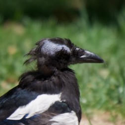

# Beaker

A tool to crop bird images to around their heads using a finetuned YOLOv8n model trained on the CUB-200-2011 dataset.

## 1. License & Usage

| Origin | Original terms | What that means for these weights |
|--------|----------------|-----------------------------------|
| **Dataset:** Caltech-UCSD Birds-200-2011 | "Images are for **non-commercial research and educational purposes only**." | ➜ **No commercial use** of the weights or any derivative work. |
| **Training code:** Ultralytics YOLOv8 | Source and official models released under **GNU AGPL-3.0** | ➜ If you **redistribute or serve** the weights, you must also release the full source & weights **under AGPL-3.0**. |

### Summary
Because the weights were trained on CUB images *and* with AGPL-licensed code, they are provided **solely for non-commercial research/education** under **AGPL-3.0**.
Commercial use would require **separate rights to the images** *and* a **non-AGPL licence from Ultralytics**.

*No warranty. Provided "as is."*

## 2. Quick Start

Install directly from GitHub using [`uv`](https://docs.astral.sh/uv/getting-started/installation/):

```bash
# Install the beaker tool
uv tool install git+https://github.com/ericphanson/beaker.git

# Run the tool:
beaker example.jpg

# Process all images in a directory
beaker path/to/images/

# Skip cropping, only show detection
beaker example.jpg --skip-crop --show

# Save bounding box images with detected heads highlighted
beaker example.jpg --save-bounding-box

# Save to specific directory with custom padding
beaker example.jpg --output-dir crops/ --padding 0.5

# Force CPU usage (useful if GPU memory issues occur)
beaker example.jpg --device cpu

# Use specific device (auto, cpu, cuda, mps). The default is "auto".
beaker example.jpg --device mps
```

For example, the example image


can be processed with

```sh
uv run python beaker/infer.py example.jpg
```

yielding the output crop saved as `example-crop.jpg` (with 25% padding around the detected head)



**Limitations:**
- Works best on clear, well-lit images of single birds
- Performance degrades with poor lighting, motion blur, or multiple birds
- May struggle with unusual poses or partially occluded heads
- False positives possible on non-bird objects. The model has _only_ been finetuned on bird images.

## 3. Model Card

**Architecture:** YOLOv8n (nano) - optimized for speed over accuracy
**Dataset:** CUB-200-2011 bird parts (head regions only)
**Training images:** ~6,000 train, ~6,000 validation
**Classes:** 1 (bird_head)
**Input size:** 640×640 pixels

**Expected performance:**
- Generally reliable on clear photos of common bird species
- May miss small or distant birds
- Accuracy not evaluated on real-world deployment scenarios
- Model size: ~6MB (nano variant prioritizes speed and portability)

## 4. Development & Training

### 4.1. Data

Download and prepare the CUB-200-2011 dataset:

1. **Download CUB-200-2011:**
   ```bash
   # Download from Caltech (requires accepting terms)
   # http://www.vision.caltech.edu/visipedia/CUB-200-2011.html
   # Extract to: data/CUB_200_2011/
   ```

2. **Convert to YOLO format:**
   ```bash
   uv run python convert_to_yolo.py
   ```

   This creates `data/yolo/` with train/val splits and YOLO-format labels. The conversion extracts head-related parts (beak, crown, forehead, eyes, nape, throat) and creates bounding boxes around them.

### 4.2. Install Dependencies

```bash
# Install all dependencies (training + preprocessing + inference)
uv sync --extra dev
```

Requires Python 3.12+. On M1/M2 Macs, verify MPS is available:
```bash
uv run python -c "import torch; print(f'MPS available: {torch.backends.mps.is_available()}')"
```

### 4.3. Training

If using [comet](https://www.comet.com/), update [`.envrc`](./envrc) to set the `COMET_WORKSPACE` variable and add your API key to your environment (`export COMET_API_KEY="your-api-key"`).

**Basic training:**
```bash
uv run python train.py
```

**Debug mode** (faster, less data):
Edit `train.py` and set `'debug_run': True` in `TRAINING_CONFIG`.

**Training notes:**
- Expects ~2-4 hours on M1 MacBook Pro for full training
- Model converges quickly but benefits from longer training
- Batch size may need adjustment based on available memory
- No hyperparameter tuning has been performed

### 4.4. Releases

Create GitHub releases with trained models:

```bash
# Ensure clean repository state
git add . && git commit -m "Update before release"

# Create release
uv run python release.py

# Follow prompts for version number and model selection
```

The script uploads the selected model as `bird-head-detector.pt` along with training artifacts (plots, configs, results).

### 4.5. ONNX Export

After creating a release, convert models to ONNX format for deployment:

```bash
# Install ONNX dependencies
uv sync --extra onnx

# Export from GitHub release
uv run python export_to_onnx.py --tag bird-head-detector-v1.0.0

# Export from local model file
uv run python export_to_onnx.py --model runs/detect/best_model/weights/best.pt

# Export with custom settings
uv run python export_to_onnx.py --tag bird-head-detector-v1.0.0 --name my_model --imgsz 640
```

ONNX models are saved in the `models/` directory for deployment to production environments or frameworks that support ONNX inference.

## 5. Note

The code in this repository was largely written by Claude Sonnet 4 via GitHub copilot.
