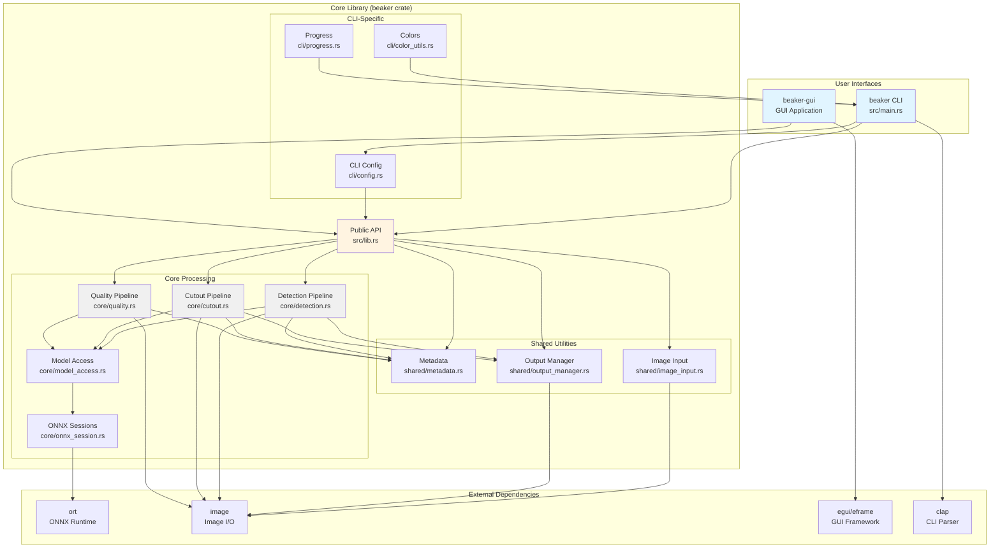
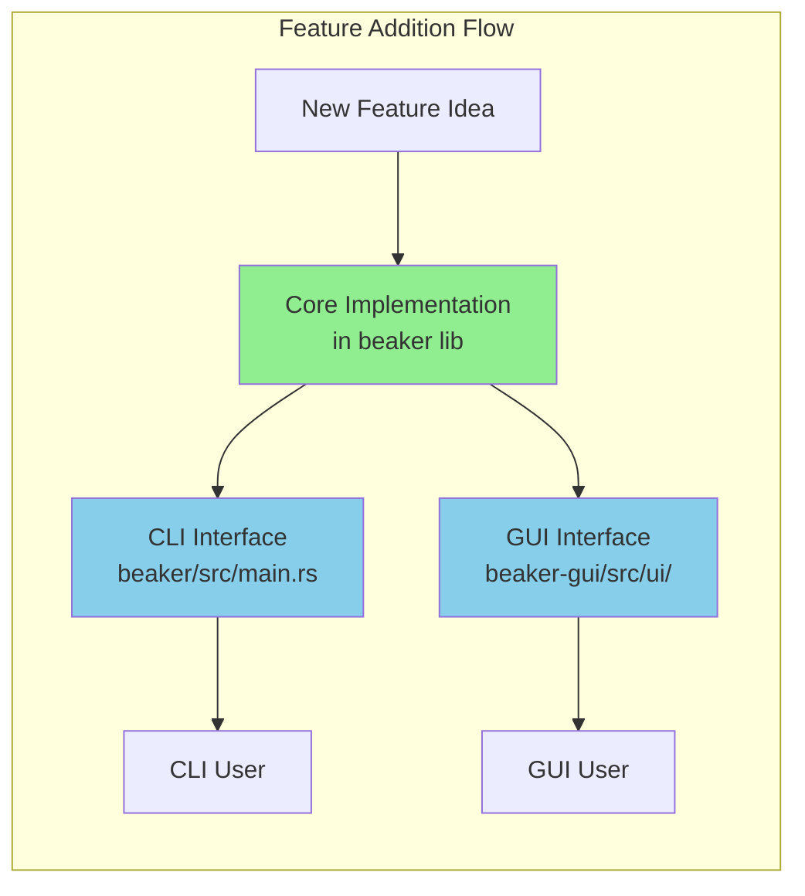
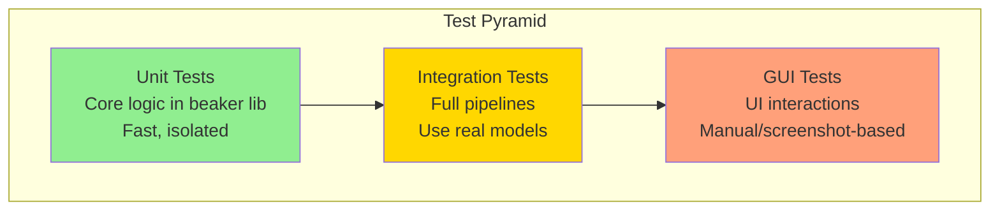

# Beaker GUI Implementation Proposal

**Date:** 2025-10-25
**Status:** Proposal
**Author:** Claude (AI Assistant)

---

## Executive Summary

This proposal outlines a comprehensive plan for adding a graphical user interface (GUI) to Beaker, the bird image analysis tool. The GUI will complement the existing CLI, providing an accessible interface for users who prefer visual workflows while maintaining the powerful batch processing capabilities that make Beaker effective.

**Key Recommendations:**
- **Framework:** egui (primary) or Tauri (web-based alternative)
- **Architecture:** Separate `beaker-gui` crate depending on `beaker` lib
- **Core Features:** Drag-and-drop image loading, live preview, batch queue management, interactive parameter tuning

---

## 1. Dependencies: GUI Framework Options

### 1.1 Framework Comparison Matrix

| Framework | Maturity | Cross-Platform | Native Look | Bundle Size | Learning Curve | Best For |
|-----------|----------|----------------|-------------|-------------|----------------|----------|
| **egui** | ⭐⭐⭐⭐⭐ | ✅ Win/Mac/Linux/Web | ❌ Custom | ~5-10MB | Low | Immediate UI, prototyping |
| **Tauri** | ⭐⭐⭐⭐ | ✅ Win/Mac/Linux | ✅ Native webview | ~3-5MB | Medium | Web-like UX |
| **Iced** | ⭐⭐⭐⭐ | ✅ Win/Mac/Linux | ❌ Custom | ~8-12MB | Medium | Reactive apps |
| **Slint** | ⭐⭐⭐ | ✅ Win/Mac/Linux | ❌ Custom | ~3-6MB | Medium | Declarative UI |
| **gtk-rs** | ⭐⭐⭐⭐⭐ | ✅ Win/Mac/Linux | ✅ GTK theme | ~15-30MB | High | Native Linux |

---

### 1.2 Detailed Framework Analysis

#### Option A: **egui** (RECOMMENDED)

**Description:** Immediate-mode GUI framework, highly productive, cross-platform including web (WASM).

**Pros:**
- ✅ Very active development (7k+ commits, 20k+ stars)
- ✅ Excellent image handling via `egui_extras::RetainedImage`
- ✅ Built-in drag-and-drop support
- ✅ Highly performant for image-heavy apps
- ✅ Can compile to web (WASM) for browser-based version
- ✅ Minimal boilerplate, rapid iteration
- ✅ Great documentation and examples
- ✅ Native file dialogs via `rfd` crate

**Cons:**
- ❌ Non-native look (custom rendering)
- ❌ Accessibility features still maturing

**Dependencies:**
```toml
[dependencies]
eframe = "0.28"           # egui framework with native backends
egui = "0.28"             # Core egui library
egui_extras = { version = "0.28", features = ["all_loaders"] }
image = "0.25"            # Already in beaker
rfd = "0.14"              # Native file dialogs
```

**Styling and Visual Polish:**

egui's default examples can look basic, but it's highly customizable. Here's how to make it look professional:

**1. Custom Themes via `egui::Style`**

egui is fully themeable via the `Style` API. You can customize:
- Colors (background, text, accents, borders)
- Spacing (padding, margins, item spacing)
- Rounding (corner radius for buttons, panels)
- Widget styles (button appearance, sliders, etc.)

```rust
// Example: Custom dark theme for Beaker
fn apply_custom_theme(ctx: &egui::Context) {
    let mut style = (*ctx.style()).clone();

    // Professional dark blue/gray color scheme
    style.visuals.window_fill = egui::Color32::from_rgb(28, 32, 38);
    style.visuals.panel_fill = egui::Color32::from_rgb(33, 37, 43);
    style.visuals.extreme_bg_color = egui::Color32::from_rgb(20, 22, 25);

    // Accent colors (teal/blue for professional look)
    style.visuals.selection.bg_fill = egui::Color32::from_rgb(0, 122, 204);
    style.visuals.widgets.active.bg_fill = egui::Color32::from_rgb(0, 136, 221);

    // Rounded corners for modern look
    style.visuals.window_rounding = egui::Rounding::same(8.0);
    style.visuals.widgets.noninteractive.rounding = egui::Rounding::same(4.0);
    style.visuals.widgets.inactive.rounding = egui::Rounding::same(4.0);
    style.visuals.widgets.hovered.rounding = egui::Rounding::same(4.0);
    style.visuals.widgets.active.rounding = egui::Rounding::same(4.0);

    // Generous spacing
    style.spacing.item_spacing = egui::vec2(12.0, 8.0);
    style.spacing.button_padding = egui::vec2(16.0, 8.0);

    ctx.set_style(style);
}
```

**2. Third-Party Theme Libraries**

- **catppuccin-egui** - Popular pastel theme ([https://github.com/catppuccin/egui](https://github.com/catppuccin/egui))
  - Mocha, Latte, Frappe, Macchiato variants
  - Easy one-line integration: `catppuccin_egui::set_theme(&ctx, catppuccin_egui::MOCHA)`

```toml
[dependencies]
catppuccin-egui = "5.0"
```

- **egui-aesthetix** - Modern theme collection ([https://github.com/Cozy-Space/egui-aesthetix](https://github.com/Cozy-Space/egui-aesthetix))
  - Tokyo Night, Nord, Dracula, Gruvbox, etc.
  - High contrast, carefully chosen color palettes

```toml
[dependencies]
egui-aesthetix = "0.2"
```

**3. Custom Fonts**

Replace default font with professional typefaces:

```rust
fn setup_fonts(ctx: &egui::Context) {
    let mut fonts = egui::FontDefinitions::default();

    // Use Inter, SF Pro, or Roboto for professional look
    fonts.font_data.insert(
        "Inter".to_owned(),
        egui::FontData::from_static(include_bytes!("../fonts/Inter-Regular.ttf")),
    );

    fonts.families
        .get_mut(&egui::FontFamily::Proportional)
        .unwrap()
        .insert(0, "Inter".to_owned());

    ctx.set_fonts(fonts);
}
```

**4. Professional Layout with egui_dock**

Add VS Code-style dockable panels:

```toml
[dependencies]
egui_dock = "0.13"
```

```rust
// Creates resizable, tabbable panels like professional IDEs
use egui_dock::{DockArea, DockState, NodeIndex};

struct BeakerApp {
    tree: DockState<String>,
}

impl eframe::App for BeakerApp {
    fn update(&mut self, ctx: &egui::Context, frame: &mut eframe::Frame) {
        DockArea::new(&mut self.tree)
            .show(ctx, &mut TabViewer {});
    }
}
```

**Example Projects (Polished egui Apps):**

- **Rerun.io** - Professional 3D visualization tool ([https://rerun.io](https://rerun.io))
  - Multi-panel layout, custom styling, looks like a native app
  - Used in production by robotics/ML companies
  - Dark theme with blue accents, generous spacing
  - **Live demo:** [https://app.rerun.io/](https://app.rerun.io/)

- **Neothesia** - Piano learning software ([https://github.com/PolyMeilex/Neothesia](https://github.com/PolyMeilex/Neothesia))
  - Modern game-like UI with egui
  - Custom shaders, smooth animations
  - Shows egui can look very polished

- **Kondo** - Disk space cleaner ([https://github.com/tbillington/kondo](https://github.com/tbillington/kondo))
  - Clean, minimal interface
  - Good use of spacing and colors
  - Looks professional despite being egui

- **Gossip** - Nostr client ([https://github.com/mikedilger/gossip](https://github.com/mikedilger/gossip))
  - Social media app with custom theme
  - Good example of theming egui for specific brand

- **Ambient** - Game engine editor ([https://github.com/AmbientRun/Ambient](https://github.com/AmbientRun/Ambient))
  - Unity-like editor interface
  - Complex multi-panel layout
  - Professional game dev tool aesthetic

- **Voxel** - 3D voxel editor ([https://github.com/franciscoaguirre/voxel-rs](https://github.com/franciscoaguirre/voxel-rs))
  - 3D viewport with egui controls
  - Shows egui works well for creative tools

**Visual Comparison:**

```
┌──────────────────────────────────────────────────────────────┐
│ Default egui (basic):                                         │
│  - Gray panels, basic fonts, minimal spacing                 │
│  - Functional but "programmer art" aesthetic                 │
│                                                               │
│ Styled egui (professional):                                  │
│  - Custom dark theme (blues/grays)                           │
│  - Modern fonts (Inter, SF Pro)                              │
│  - Generous spacing and padding                              │
│  - Rounded corners (8px windows, 4px widgets)                │
│  - Consistent accent colors                                  │
│  - Result: Looks like a polished native app                  │
│                                                               │
│ Example: Rerun.io                                            │
│  ┌────────────────────────────────────────────────┐          │
│  │ File View Timeline Help                        │          │
│  ├─────────┬──────────────────────┬───────────────┤          │
│  │ Entity │ [3D Viewport]        │ Inspector     │          │
│  │ Tree    │                      │               │          │
│  │  □ Robot│  [Rendered scene]   │ • Position    │          │
│  │  □ Camera│                     │ • Rotation    │          │
│  │  □ Path │ ━━●━━━━━━━━━━━━━━━  │ • Scale       │          │
│  │         │   Timeline           │               │          │
│  └─────────┴──────────────────────┴───────────────┘          │
│  Professional dark theme, no "toy" appearance                │
└──────────────────────────────────────────────────────────────┘
```

**Tips for Professional egui Apps:**

1. **Use consistent spacing**: Don't use default spacing, increase it
2. **Pick a cohesive color palette**: Use tools like coolors.co
3. **Add subtle animations**: egui supports animated values
4. **Use egui_dock**: Makes your app feel like VS Code/Photoshop
5. **Custom fonts matter**: Inter, SF Pro, or Roboto > default
6. **Icons help**: Use `egui_phosphor` or similar icon packs
7. **Add empty space**: Don't cram UI, let it breathe

```toml
# Additional polish crates
[dependencies]
egui_dock = "0.13"           # VS Code-style docking
egui_phosphor = "0.6"        # Icon library
catppuccin-egui = "5.0"      # Pre-made themes
```

**Impact:**
- Development time: **Fast** (~2-4 weeks for MVP)
- Styling time: **+1-3 days** for custom theme/polish
- Maintenance: **Low** (stable API, good ecosystem)
- Distribution: **Easy** (single binary)
- File size overhead: **~5-10MB** (custom fonts add ~200KB)

**Bottom Line:**

egui's defaults are basic, but with 1-3 days of styling work (custom theme, fonts, spacing), you can achieve a professional look that rivals native apps. The framework is designed to be fully customizable. Rerun.io proves egui can power production tools used by companies—it just needs intentional design work upfront.

---

#### Option B: **Tauri** (Web-based Alternative)

**Description:** Use web technologies (HTML/CSS/JS or Svelte/React) for UI, Rust for backend logic.

**Pros:**
- ✅ Native OS look and feel (uses system webview)
- ✅ Leverage existing web UI libraries (React, Svelte, Vue)
- ✅ Very small bundle size (~3-5MB overhead)
- ✅ Easier to find UI/UX designers familiar with web tech
- ✅ Auto-updates built-in
- ✅ Excellent documentation

**Cons:**
- ❌ Requires managing frontend build process (npm/pnpm)
- ❌ IPC overhead between Rust and frontend
- ❌ Larger development surface area
- ❌ Image handling requires encoding/decoding for IPC

**Dependencies:**
```toml
[dependencies]
tauri = "2.0"
serde = "1.0"       # Already in beaker
serde_json = "1.0"  # Already in beaker
```

**Frontend Options:**
- Svelte + TypeScript (recommended for simplicity)
- React + TypeScript (if team prefers)
- Vanilla HTML/CSS/JS (for minimal complexity)

**Example Projects:**
- **Xplorer** - File manager ([https://xplorer.space](https://xplorer.space))
  - Screenshot: Modern file browser with sidebar, preview pane
- **Pomatez** - Pomodoro timer ([https://github.com/zidoro/pomatez](https://github.com/zidoro/pomatez))
  - Screenshot: Clean, minimal interface with settings panels

**Visual Reference:**
```
┌─────────────────────────────────────────────────┐
│  Typical Tauri App:                             │
│  - Native window chrome (macOS/Windows)         │
│  - Web-like animations and transitions          │
│  - System font rendering                        │
│  - OS-native context menus                      │
└─────────────────────────────────────────────────┘
```

**Impact:**
- Development time: **Medium** (~4-6 weeks for MVP)
- Maintenance: **Medium** (two codebases: Rust + frontend)
- Distribution: **Easy** (single bundle)
- File size overhead: **~3-5MB**

---

#### Option C: **Iced** (Elm-inspired)

**Description:** Declarative, reactive GUI framework inspired by Elm architecture.

**Pros:**
- ✅ Clean reactive model (message passing)
- ✅ Cross-platform including web (experimental)
- ✅ Good performance
- ✅ Type-safe UI updates
- ✅ Built-in async support

**Cons:**
- ❌ Smaller ecosystem than egui
- ❌ Less flexible for complex custom layouts
- ❌ Steeper learning curve (Elm architecture paradigm)

**Dependencies:**
```toml
[dependencies]
iced = { version = "0.12", features = ["tokio", "image"] }
```

**Example Projects:**
- **Halloy** - IRC client ([https://github.com/squidowl/halloy](https://github.com/squidowl/halloy))
  - Screenshot: Chat interface with multiple channels, message history
- **Cosmic Text Editor** - Part of System76's COSMIC desktop
  - Screenshot: Modern text editor with syntax highlighting

**Impact:**
- Development time: **Medium** (~3-5 weeks)
- Maintenance: **Low**
- Distribution: **Easy**
- File size overhead: **~8-12MB**

---

#### Option D: **Slint** (Declarative UI)

**Description:** Modern declarative UI framework with custom markup language.

**Pros:**
- ✅ Very clean declarative syntax
- ✅ Good tooling (live preview, LSP)
- ✅ Small binary size
- ✅ Commercial backing

**Cons:**
- ❌ Smaller community
- ❌ New markup language to learn (.slint files)
- ❌ Less mature than egui/gtk

**Dependencies:**
```toml
[dependencies]
slint = "1.7"
```

**Impact:**
- Development time: **Medium** (~3-5 weeks)
- Maintenance: **Medium**
- Distribution: **Easy**
- File size overhead: **~3-6MB**

---

#### Option E: **gtk-rs** (GTK Bindings)

**Description:** Rust bindings for GTK, mature native toolkit.

**Pros:**
- ✅ Very mature and stable
- ✅ Native look on Linux (GNOME)
- ✅ Rich widget set
- ✅ Excellent accessibility

**Cons:**
- ❌ Large dependency (GTK runtime)
- ❌ Verbose API
- ❌ macOS/Windows support suboptimal
- ❌ Distribution complexity (GTK runtime required)

**Impact:**
- Development time: **Slow** (~6-8 weeks)
- Maintenance: **Medium**
- Distribution: **Complex** (GTK dependencies)
- File size overhead: **~15-30MB + GTK runtime**

---

### 1.3 Framework Recommendation

**Primary Recommendation: egui**

**Rationale:**
1. **Excellent fit for image-heavy workflows** - Beaker processes images extensively
2. **Fast development velocity** - Immediate mode = less boilerplate
3. **Cross-platform parity** - Same look/feel on all OSes (good for screenshots/documentation)
4. **Bonus: Web deployment** - Could offer browser-based version via WASM
5. **Active ecosystem** - Strong community, frequent updates
6. **Low distribution complexity** - Single binary

**Secondary Recommendation: Tauri**

**If these factors apply:**
- Team has strong web/frontend expertise
- Want native OS look and feel
- Need maximum flexibility in UI design
- Want to leverage web component libraries

---

## 2. Code Structure: Architecture & Organization

### 2.1 Recommended Architecture: Multi-Crate Workspace

**Decision: Separate `beaker-gui` crate depending on `beaker` lib**

#### 2.1.1 Rationale

✅ **Separation of concerns:** CLI and GUI are different interfaces to same core logic
✅ **Compile time optimization:** CLI users don't pay for GUI dependencies
✅ **Independent versioning:** Can iterate GUI without touching stable lib
✅ **DX benefits:** Clear boundaries, easier testing, parallel development
✅ **Library reusability:** Core logic usable by other tools/scripts

#### 2.1.2 Proposed Workspace Structure

```
beaker/
├── Cargo.toml                    # Workspace root
│   [workspace]
│   members = ["beaker", "beaker-gui"]
│
├── beaker/                       # Core library + CLI (existing)
│   ├── Cargo.toml                # lib + [[bin]] for CLI
│   ├── src/
│   │   ├── lib.rs                # Public API (expand from current 25 lines)
│   │   ├── main.rs               # CLI entry point (keep as-is)
│   │   ├── bin/
│   │   │   └── beaker-cli.rs     # Alternative: rename main.rs to this
│   │   ├── core/                 # NEW: Core processing logic (models, pipelines)
│   │   │   ├── mod.rs
│   │   │   ├── detection.rs      # Move from src/detection.rs
│   │   │   ├── cutout.rs         # Move from src/cutout_processing.rs
│   │   │   ├── quality.rs        # Move from src/quality_processing.rs
│   │   │   ├── model_access.rs
│   │   │   ├── onnx_session.rs
│   │   │   └── ...
│   │   ├── cli/                  # NEW: CLI-specific code
│   │   │   ├── mod.rs
│   │   │   ├── config.rs         # Move from src/config.rs
│   │   │   ├── color_utils.rs
│   │   │   └── progress.rs
│   │   ├── shared/               # NEW: Shared utilities
│   │   │   ├── mod.rs
│   │   │   ├── metadata.rs       # Move from src/shared_metadata.rs
│   │   │   ├── image_input.rs
│   │   │   ├── output_manager.rs
│   │   │   └── ...
│   │   └── ... (other modules)
│   └── tests/
│
├── beaker-gui/                   # NEW: GUI application
│   ├── Cargo.toml
│   │   [dependencies]
│   │   beaker = { path = "../beaker" }
│   │   eframe = "0.28"
│   │   egui = "0.28"
│   │   ...
│   ├── src/
│   │   ├── main.rs               # GUI entry point
│   │   ├── app.rs                # Main application state
│   │   ├── ui/                   # UI components
│   │   │   ├── mod.rs
│   │   │   ├── image_viewer.rs   # Image display widget
│   │   │   ├── detection_panel.rs
│   │   │   ├── cutout_panel.rs
│   │   │   ├── quality_panel.rs
│   │   │   ├── batch_queue.rs
│   │   │   └── settings.rs
│   │   ├── state/                # Application state management
│   │   │   ├── mod.rs
│   │   │   ├── job_queue.rs      # Processing queue
│   │   │   ├── results.rs        # Results cache
│   │   │   └── preferences.rs    # User preferences
│   │   └── utils/
│   │       ├── mod.rs
│   │       ├── image_loading.rs  # Async image loading
│   │       └── file_ops.rs       # Drag-drop handling
│   └── assets/
│       └── icon.png
│
├── docs/
│   └── plans/
│       └── 2025-10-25-gui-plan.md  # This document
│
└── README.md
```

---

### 2.2 Detailed Architecture Diagrams

#### 2.2.1 Dependency Graph



---

#### 2.2.2 Data Flow: Feature Flow from Lib to CLI/GUI



**Example: Adding Species Classification**

```
1. Core Library (beaker/src/core/species.rs)
   ├─ SpeciesClassifier trait
   ├─ process_image(&image) -> SpeciesResult
   └─ Export via beaker/src/lib.rs: pub use core::species::*;

2. CLI Integration (beaker/src/main.rs)
   ├─ Add "beaker species" subcommand
   ├─ Call lib functions: beaker::species::process_image()
   └─ Display results in terminal

3. GUI Integration (beaker-gui/src/ui/species_panel.rs)
   ├─ Add "Species" tab
   ├─ Call same lib functions: beaker::species::process_image()
   └─ Display results in UI panel
```

**Key Principle:** All business logic lives in `beaker` lib, interfaces are thin wrappers.

---

#### 2.2.3 Public API Design (beaker/src/lib.rs)

**Current State:** Only 25 lines, mostly module exports

**Proposed Enhanced API:**

```rust
// beaker/src/lib.rs

//! Beaker: Bird image analysis with machine learning
//!
//! This library provides bird detection, background removal,
//! and image quality assessment using ONNX models.

// Re-export core types
pub use crate::core::{
    detection::{DetectionPipeline, DetectionResult, DetectionClass},
    cutout::{CutoutPipeline, CutoutResult},
    quality::{QualityPipeline, QualityResult},
    model_access::{ModelSource, ModelConfig},
    onnx_session::{DeviceType, ExecutionProvider},
};

pub use crate::shared::{
    metadata::{Metadata, InputProcessing, SystemInfo},
    image_input::{ImageSource, discover_images},
    output_manager::{OutputManager, OutputConfig},
};

// Public modules
pub mod core {
    pub mod detection;
    pub mod cutout;
    pub mod quality;
    pub mod model_access;
    pub mod onnx_session;
}

pub mod shared {
    pub mod metadata;
    pub mod image_input;
    pub mod output_manager;
}

// High-level convenience functions
pub mod prelude {
    //! Convenience re-exports for common use cases
    pub use crate::{
        DetectionPipeline, DetectionResult,
        CutoutPipeline, CutoutResult,
        QualityPipeline, QualityResult,
        DeviceType,
    };
}

/// Library version
pub const VERSION: &str = env!("CARGO_PKG_VERSION");

/// Common error type
pub use anyhow::{Error, Result};
```

**Usage from GUI:**

```rust
// beaker-gui/src/app.rs
use beaker::prelude::*;

let pipeline = DetectionPipeline::new(config)?;
let result = pipeline.process_image(image_path)?;
```

---

### 2.3 Alternative Architecture: Monolithic Single Crate

**NOT RECOMMENDED, but documented for completeness**

```
beaker/
├── Cargo.toml
│   [features]
│   default = ["cli"]
│   cli = ["clap"]
│   gui = ["egui", "eframe"]
│
└── src/
    ├── lib.rs
    ├── bin/
    │   ├── beaker.rs      # CLI
    │   └── beaker-gui.rs  # GUI
    └── ...
```

**Why NOT recommended:**
❌ GUI dependencies compile even for CLI users (without careful feature gating)
❌ Harder to maintain clean separation
❌ Larger binary size if both features enabled
❌ Confusing for contributors (less clear boundaries)

**Only use if:**
- Codebase stays very small (<5k lines total)
- GUI and CLI share 90%+ of code
- Don't want workspace complexity

---

### 2.4 Build and Distribution

#### 2.4.1 Build Commands

```bash
# Build CLI only (no GUI dependencies)
cargo build --release -p beaker

# Build GUI only
cargo build --release -p beaker-gui

# Build both
cargo build --release

# Run CLI
cargo run -p beaker -- detect image.jpg

# Run GUI
cargo run -p beaker-gui
```

#### 2.4.2 Binary Distribution

**CLI Binary:** `beaker` or `beaker.exe`
- Size: ~8-12 MB (current, no GUI deps)
- Install: `cargo install --path beaker`

**GUI Binary:** `beaker-gui` or `beaker-gui.exe`
- Size: ~15-20 MB (includes egui + beaker)
- Install: `cargo install --path beaker-gui`

**Optional:** Create unified `beaker` binary with subcommand:
```bash
beaker detect ...    # CLI mode
beaker gui           # Launch GUI
```

---

### 2.5 Testing Strategy



**Test Distribution:**
- **Unit tests:** Core algorithms (blur detection, mask encoding, etc.) - Already exists
- **Integration tests:** Full pipelines (detect, cutout, quality) - Already exists
- **GUI tests:** Mostly manual, screenshot regression testing (optional)

**GUI Testing Notes:**
- egui has limited automated testing support
- Focus on testing business logic in lib (already done)
- GUI tests mainly for catching visual regressions

---

## 3. Features: GUI Capabilities & Mockups

### 3.1 Core Feature Set

#### 3.1.1 MVP Features (Phase 1)

1. **Image Loading**
   - Drag-and-drop image files
   - File browser dialog
   - Recent files list
   - Batch image queue

2. **Detection Tool**
   - Confidence slider (0.0-1.0)
   - Class selection checkboxes (bird, head, eye, beak)
   - Live preview with bounding boxes
   - Crop preview thumbnails

3. **Background Removal Tool**
   - Toggle post-processing
   - Alpha matting controls
   - Background color picker
   - Cutout preview with transparency

4. **Quality Assessment Tool**
   - Quality score display
   - Blur heatmap visualization
   - Quality grid overlay

5. **Settings**
   - Device selection (auto/CPU/CoreML)
   - Output directory picker
   - Metadata export toggle
   - Model cache management

6. **Batch Processing**
   - Queue management (add/remove/reorder)
   - Progress bar with time estimates
   - Batch export to folder

---

#### 3.1.2 Advanced Features (Phase 2)

7. **Side-by-side Comparison**
   - Before/after view
   - Slider for blend comparison

8. **Export Options**
   - Format selection (PNG/JPEG)
   - Quality settings
   - Filename templates

9. **Annotation Tools**
   - Manual bounding box adjustment
   - Detection confidence override
   - Notes/tags per image

10. **Metadata Viewer**
    - Pretty-printed TOML viewer
    - JSON export
    - Copy to clipboard

11. **Model Management**
    - Download status indicators
    - Cache size display
    - Clear cache button
    - Custom model loading

---

### 3.2 ASCII Mockups

#### 3.2.1 Main Application Window

```
┌─────────────────────────────────────────────────────────────────────────────────┐
│ Beaker - Bird Image Analysis                                      [_] [□] [×]   │
├─────────────────────────────────────────────────────────────────────────────────┤
│ File  Edit  View  Tools  Help                                                   │
├──────────────┬──────────────────────────────────────────────────────────────────┤
│              │                                                                   │
│  Detection   │  ┌──────────────────────────────────────────────────┐            │
│  Cutout      │  │                                                  │            │
│  Quality     │  │                                                  │            │
│ ─────────    │  │                                                  │            │
│  Settings    │  │         [Drag and drop images here]             │            │
│  About       │  │                                                  │            │
│              │  │              or click to browse                  │            │
│              │  │                                                  │            │
│              │  │          📁 Supported: JPG, PNG                  │            │
│              │  │                                                  │            │
│              │  └──────────────────────────────────────────────────┘            │
│              │                                                                   │
│              │  Recent Images:                                                  │
│              │  • sparrow.jpg                                 2025-10-25 10:23  │
│              │  • cardinal.jpg                                2025-10-25 09:15  │
│              │                                                                   │
├──────────────┴──────────────────────────────────────────────────────────────────┤
│ Ready                                                         Device: CoreML ▼  │
└─────────────────────────────────────────────────────────────────────────────────┘
```

---

#### 3.2.2 Detection Tool Interface

```
┌─────────────────────────────────────────────────────────────────────────────────┐
│ Beaker - Detection                                             [_] [□] [×]      │
├──────────────┬──────────────────────────────────────────────────────────────────┤
│              │  ┌───────────────────────┐  ┌────────────────────────────────┐  │
│  Detection ✓ │  │                       │  │ Controls                       │  │
│  Cutout      │  │                       │  │                                │  │
│  Quality     │  │    [Image Preview]    │  │ Confidence:  0.50              │  │
│ ─────────    │  │                       │  │ ◄──────●─────────────────► 1.0 │  │
│  Settings    │  │    [Bird with boxes]  │  │                                │  │
│  About       │  │                       │  │ Detect Classes:                │  │
│              │  │                       │  │  ☑ Bird                        │  │
│              │  │     720x480 pixels    │  │  ☑ Head                        │  │
│              │  │                       │  │  ☐ Eye                         │  │
│              │  └───────────────────────┘  │  ☐ Beak                        │  │
│              │                              │                                │  │
│              │  Results:                    │ [ Detect ] [ Save Crops... ]   │  │
│              │  ┌─────────┬─────────┐      │                                │  │
│              │  │  Bird   │  Head   │      │ Outputs:                       │  │
│              │  │ ┌─────┐ │ ┌─────┐ │      │  ☑ Save crops                  │  │
│              │  │ │ 🦜  │ │ │ 🦜  │ │      │  ☑ Draw bounding boxes         │  │
│              │  │ └─────┘ │ └─────┘ │      │  ☑ Generate metadata           │  │
│              │  │  0.92   │  0.87   │      │                                │  │
│              │  └─────────┴─────────┘      │ Output folder:                 │  │
│              │                              │  /home/user/output  [ ... ]    │  │
│              │  2 detections found          │                                │  │
│              │  Processing time: 63ms       └────────────────────────────────┘  │
├──────────────┴──────────────────────────────────────────────────────────────────┤
│ Processed: sparrow.jpg                                   Model: bird-v1.0.0    │
└─────────────────────────────────────────────────────────────────────────────────┘
```

---

#### 3.2.3 Background Removal Interface

```
┌─────────────────────────────────────────────────────────────────────────────────┐
│ Beaker - Background Removal                                [_] [□] [×]          │
├──────────────┬──────────────────────────────────────────────────────────────────┤
│              │  ┌──────────────┬──────────────┐  ┌──────────────────────────┐  │
│  Detection   │  │   Original   │    Cutout    │  │ Controls                 │  │
│  Cutout    ✓ │  │              │              │  │                          │  │
│  Quality     │  │  ┌────────┐  │  ┌────────┐  │  │ ☑ Post-process mask      │  │
│ ─────────    │  │  │        │  │  │   🦜   │  │  │ ☑ Alpha matting          │  │
│  Settings    │  │  │   🦜   │  │  │ [✓✓✓]  │  │  │                          │  │
│  About       │  │  │ [trees]│  │  │        │  │  │ Foreground threshold:    │  │
│              │  │  │        │  │  │        │  │  │ ◄──────●────► 240        │  │
│              │  │  └────────┘  │  └────────┘  │  │                          │  │
│              │  │              │              │  │ Background threshold:    │  │
│              │  │  Drag slider │ to compare   │  │ ◄●──────────► 10         │  │
│              │  │              │              │  │                          │  │
│              │  └──────────────┴──────────────┘  │ Erode size:              │  │
│              │                                    │ ◄────●──────► 10         │  │
│              │  ┌────────────────────────────┐   │                          │  │
│              │  │ Mask Preview               │   │ Background color:        │  │
│              │  │ ████████████████           │   │  ⬜ Transparent           │  │
│              │  │ ████████████████           │   │  ◻️ Custom: [#______]    │  │
│              │  │ ██████  ████████           │   │                          │  │
│              │  │    ████████████            │   │ [ Process ] [ Export ] │  │
│              │  │     ███████████            │   │                          │  │
│              │  └────────────────────────────┘   │ ☐ Save mask separately   │  │
│              │                                    └──────────────────────────┘  │
├──────────────┴──────────────────────────────────────────────────────────────────┤
│ Processed: cardinal.jpg                              Processing time: 602ms    │
└─────────────────────────────────────────────────────────────────────────────────┘
```

---

#### 3.2.4 Batch Processing Interface

```
┌─────────────────────────────────────────────────────────────────────────────────┐
│ Beaker - Batch Processing                                  [_] [□] [×]          │
├──────────────┬──────────────────────────────────────────────────────────────────┤
│              │  ┌──────────────────────────────────────────────────────────┐    │
│  Detection   │  │ Batch Queue                                      8 items │    │
│  Cutout      │  ├──────────────────────────────────────────────────────────┤    │
│  Quality     │  │ Status  │ Filename           │ Size      │ Output        │    │
│ ─────────    │  ├─────────┼────────────────────┼───────────┼───────────────┤    │
│  Batch     ✓ │  │   ✓     │ sparrow_001.jpg    │ 1.2 MB    │ 2 crops       │    │
│ ─────────    │  │   ✓     │ cardinal_01.jpg    │ 980 KB    │ 3 crops       │    │
│  Settings    │  │   ⟳     │ blue_jay.jpg       │ 1.5 MB    │ Processing... │    │
│  About       │  │   ○     │ robin.jpg          │ 1.1 MB    │ Queued        │    │
│              │  │   ○     │ finch_002.jpg      │ 890 KB    │ Queued        │    │
│              │  │   ○     │ woodpecker.jpg     │ 2.3 MB    │ Queued        │    │
│              │  │   ○     │ owl_night.jpg      │ 1.8 MB    │ Queued        │    │
│              │  │   ○     │ hawk_sky.jpg       │ 1.4 MB    │ Queued        │    │
│              │  └──────────────────────────────────────────────────────────┘    │
│              │                                                                   │
│              │  [ + Add Images ] [ - Remove ] [ ↑ ] [ ↓ ] [ Clear All ]         │
│              │                                                                   │
│              │  ┌──────────────────────────────────────────────────────────┐    │
│              │  │ Progress:  blue_jay.jpg (3 of 8)                         │    │
│              │  │ ████████████████░░░░░░░░░░░░░░░░░░░░░░░░  37% complete   │    │
│              │  │ Elapsed: 00:02:15  |  Remaining: ~00:03:45               │    │
│              │  └──────────────────────────────────────────────────────────┘    │
│              │                                                                   │
│              │  Operation: Detection    Confidence: 0.50    Device: CoreML      │
│              │                                                                   │
│              │  [ ▶ Start ] [ ⏸ Pause ] [ ⏹ Stop ]     [ Export All Results ]   │
│              │                                                                   │
├──────────────┴──────────────────────────────────────────────────────────────────┤
│ Processing batch...                                    Avg time/image: 45s     │
└─────────────────────────────────────────────────────────────────────────────────┘
```

---

#### 3.2.5 Quality Assessment Interface

```
┌─────────────────────────────────────────────────────────────────────────────────┐
│ Beaker - Image Quality                                  [_] [□] [×]             │
├──────────────┬──────────────────────────────────────────────────────────────────┤
│              │  ┌────────────────────────┐  ┌────────────────────────────────┐  │
│  Detection   │  │                        │  │ Quality Metrics                │  │
│  Cutout      │  │                        │  │                                │  │
│  Quality   ✓ │  │   [Image with grid]    │  │ Overall Quality:               │  │
│ ─────────    │  │                        │  │  ████████░░  8.2 / 10          │  │
│  Settings    │  │   [Heatmap overlay]    │  │                                │  │
│  About       │  │                        │  │ Blur Score:                    │  │
│              │  │   Green = sharp        │  │  ██████░░░░  6.5 / 10          │  │
│              │  │   Red = blurry         │  │                                │  │
│              │  │                        │  │ Sharpest Region:               │  │
│              │  └────────────────────────┘  │  Top-center (9.1/10)           │  │
│              │                               │                                │  │
│              │  ┌────────────────────────┐  │ Blurriest Region:              │  │
│              │  │ Quality Grid (20×20)   │  │  Bottom-left (4.2/10)          │  │
│              │  │ ░░░░████████████████   │  │                                │  │
│              │  │ ░░░░████████████████   │  │ Recommendations:               │  │
│              │  │ ████████████████████   │  │  • Good overall sharpness      │  │
│              │  │ ████████████████████   │  │  • Consider cropping bottom    │  │
│              │  │ ████████████████░░░░   │  │    edge (lower quality)        │  │
│              │  │ ██████████████░░░░░░   │  │                                │  │
│              │  └────────────────────────┘  │ [ Analyze ] [ Export Report ]  │  │
│              │                               │                                │  │
│              │  Processing time: 134ms       └────────────────────────────────┘  │
├──────────────┴──────────────────────────────────────────────────────────────────┤
│ Analyzed: blue_jay.jpg                                   Model: PAQ2PiQ-int8   │
└─────────────────────────────────────────────────────────────────────────────────┘
```

---

#### 3.2.6 Settings Panel

```
┌─────────────────────────────────────────────────────────────────────────────────┐
│ Beaker - Settings                                       [_] [□] [×]             │
├──────────────┬──────────────────────────────────────────────────────────────────┤
│              │  ┌──────────────────────────────────────────────────────────┐    │
│  Detection   │  │ General                                                  │    │
│  Cutout      │  │                                                          │    │
│  Quality     │  │ Device Selection:                                        │    │
│ ─────────    │  │  ○ Auto (recommended)                                    │    │
│  Settings  ✓ │  │  ○ CPU                                                   │    │
│  About       │  │  ○ CoreML (macOS only)                                   │    │
│              │  │                                                          │    │
│              │  │ Default Output Directory:                                │    │
│              │  │  /home/user/beaker-output                  [ Browse... ] │    │
│              │  │                                                          │    │
│              │  │ ☑ Generate metadata files (.toml)                        │    │
│              │  │ ☐ Overwrite existing files without asking                │    │
│              │  │ ☑ Show processing time in results                        │    │
│              │  │                                                          │    │
│              │  ├──────────────────────────────────────────────────────────┤    │
│              │  │ Model Cache                                              │    │
│              │  │                                                          │    │
│              │  │ Cache Location:                                          │    │
│              │  │  /home/user/.cache/onnx-models                           │    │
│              │  │                                                          │    │
│              │  │ Cache Size: 94.2 MB (3 models)                           │    │
│              │  │                                                          │    │
│              │  │ Models:                                                  │    │
│              │  │  • bird-orientation-detector-v1.0.0.onnx     30.1 MB  ✓  │    │
│              │  │  • isnet-general-use.onnx                    42.8 MB  ✓  │    │
│              │  │  • quality-dynamic-int8.onnx                 21.3 MB  ✓  │    │
│              │  │                                                          │    │
│              │  │ [ Clear Cache ] [ Verify Models ] [ Download All ]       │    │
│              │  │                                                          │    │
│              │  ├──────────────────────────────────────────────────────────┤    │
│              │  │ Appearance                                               │    │
│              │  │                                                          │    │
│              │  │ Theme:  ○ Light  ● Dark  ○ System                        │    │
│              │  │                                                          │    │
│              │  └──────────────────────────────────────────────────────────┘    │
│              │                                                                   │
│              │              [ Reset to Defaults ]  [ Apply ]  [ OK ]            │
├──────────────┴──────────────────────────────────────────────────────────────────┤
│ Settings                                                                        │
└─────────────────────────────────────────────────────────────────────────────────┘
```

---

### 3.3 Feature Descriptions

#### 3.3.1 Drag-and-Drop Image Loading

**Implementation:**
- Use `egui::CentralPanel` with `ui.input(|i| i.raw.dropped_files)`
- Support multiple file drops
- Validate file types (jpg, png)
- Add to batch queue or process immediately

**Code sketch:**
```rust
if let Some(files) = ui.input(|i| i.raw.dropped_files.clone()) {
    for file in files {
        if let Some(path) = &file.path {
            if is_supported_image(path) {
                self.add_to_queue(path.clone());
            }
        }
    }
}
```

---

#### 3.3.2 Live Preview with Annotations

**Implementation:**
- Use `egui::Image` with `egui_extras::RetainedImage`
- Overlay bounding boxes using `egui::Painter`
- Update on parameter change (debounced)

**Features:**
- Zoom in/out (mouse wheel)
- Pan (drag with mouse)
- Toggle annotation visibility
- Color-coded by class (bird=green, head=blue, eye=yellow, beak=red)

---

#### 3.3.3 Interactive Parameter Controls

**Detection:**
- Confidence slider: `ui.add(egui::Slider::new(&mut confidence, 0.0..=1.0))`
- Class checkboxes: `ui.checkbox(&mut detect_bird, "Bird")`

**Cutout:**
- Alpha matting threshold sliders
- Background color picker: `ui.color_edit_button_rgba(&mut bg_color)`
- Post-processing toggles

**Quality:**
- Display-only (no parameters for quality assessment)
- Show quality grid as heatmap

---

#### 3.3.4 Batch Queue Management

**Features:**
- List view with columns: status, filename, size, output
- Add/remove images
- Drag to reorder
- Start/pause/stop batch processing
- Progress bar with time estimates

**State Management:**
```rust
struct BatchJob {
    path: PathBuf,
    status: JobStatus,
    result: Option<ProcessingResult>,
}

enum JobStatus {
    Queued,
    Processing,
    Completed,
    Failed(String),
}
```

---

#### 3.3.5 Results Visualization

**Detection:**
- Thumbnail grid of crops
- Confidence scores
- Click to view full-size

**Cutout:**
- Side-by-side comparison (original vs cutout)
- Slider for blend overlay
- Checkerboard background for transparency

**Quality:**
- Quality score gauge (0-10)
- Heatmap overlay on image
- Region-level quality breakdown

---

#### 3.3.6 Export and Sharing

**Export Options:**
- Individual image export
- Batch export to folder
- Metadata export (TOML/JSON)
- Copy results to clipboard

**Filename Templates:**
- `{original}_crop.jpg`
- `{original}_cutout.png`
- `{original}.beaker.toml`

---

### 3.4 User Experience Flow

#### 3.4.1 Typical Workflow: Single Image Detection

```
1. Launch beaker-gui
2. Drag bird.jpg onto window
3. Image loads in Detection tab
4. Adjust confidence slider to 0.6
5. Check "Bird" and "Head" classes
6. Click "Detect"
   → Processing indicator shows
   → Results appear after ~60ms
7. View crops in thumbnail grid
8. Click "Save Crops..."
9. Select output folder
10. Done! Crops saved to disk
```

---

#### 3.4.2 Typical Workflow: Batch Background Removal

```
1. Launch beaker-gui
2. Switch to Batch tab
3. Click "Add Images"
4. Multi-select 50 bird photos
5. Switch to Cutout settings
6. Enable alpha matting
7. Set background color to white
8. Return to Batch tab
9. Click "Start"
   → Progress bar shows 0% → 100%
   → Each image processed sequentially
10. Click "Export All Results"
11. Select output folder
12. Done! 50 cutouts saved
```

---

## 4. Implementation Roadmap

### Phase 1: MVP (2-4 weeks)

**Week 1-2: Core Structure**
- [ ] Set up `beaker-gui` crate in workspace
- [ ] Refactor `beaker` lib to expose public API
- [ ] Create basic egui app skeleton
- [ ] Implement drag-and-drop image loading
- [ ] Add file browser dialog

**Week 3-4: Detection Tool**
- [ ] Detection parameter controls (confidence, classes)
- [ ] Integration with `beaker::DetectionPipeline`
- [ ] Async processing with progress indicator
- [ ] Results display (bounding boxes, crops)
- [ ] Export functionality

**Deliverable:** Working GUI for detection with single image support

---

### Phase 2: Full Feature Set (3-5 weeks)

**Week 5-6: Cutout & Quality Tools**
- [ ] Cutout parameter controls
- [ ] Live preview with before/after comparison
- [ ] Quality assessment display with heatmap
- [ ] Settings panel (device, output dir, cache)

**Week 7-8: Batch Processing**
- [ ] Batch queue UI
- [ ] Multi-threaded processing
- [ ] Progress tracking per image
- [ ] Batch export

**Week 9: Polish & Testing**
- [ ] Error handling and user feedback
- [ ] Keyboard shortcuts
- [ ] Dark/light theme toggle
- [ ] User testing and bug fixes

**Deliverable:** Full-featured GUI with all three tools and batch support

---

### Phase 3: Advanced Features (Optional, 2-4 weeks)

- [ ] Annotation tools (manual box adjustment)
- [ ] Metadata viewer/editor
- [ ] Export presets
- [ ] Model management UI
- [ ] Comparison mode (side-by-side multiple images)
- [ ] Undo/redo support

---

## 5. Risks and Mitigations

| Risk | Impact | Mitigation |
|------|--------|------------|
| GUI framework learning curve | Medium | Start with egui tutorials, use examples extensively |
| Performance with large images | High | Use background threads, lazy loading, downsampled previews |
| Cross-platform testing overhead | Medium | Focus on one platform initially (macOS or Linux) |
| Model loading times | Medium | Cache sessions between operations, show progress spinners |
| Complex state management | High | Use clear state machine, consider `egui-dock` for panels |
| Binary size bloat | Low | Accept ~5-10MB overhead for GUI deps, optimize if needed |

---

## 6. Open Questions

1. **Unified binary vs separate binaries?**
   - Recommendation: Separate for now, can merge later if needed

2. **Should GUI support custom model paths?**
   - Recommendation: Yes, via Settings panel

3. **Web version (WASM) priority?**
   - Recommendation: Phase 3 stretch goal, egui supports it natively

4. **Should CLI and GUI share progress bar code?**
   - Recommendation: No, they use different libraries (indicatif vs egui)

5. **Support for video input?**
   - Recommendation: Out of scope for initial GUI

---

## 7. Success Metrics

**MVP Success Criteria:**
- [ ] GUI can detect birds in images
- [ ] Results match CLI output exactly
- [ ] Works on macOS and Linux
- [ ] Binary size <25MB
- [ ] Startup time <2 seconds
- [ ] Processing time within 10% of CLI

**User Satisfaction:**
- [ ] User can complete basic workflow without documentation
- [ ] No crashes during normal operation
- [ ] Clear error messages for invalid inputs

---

## 8. Conclusion

This proposal recommends:

1. **egui** as the GUI framework for fast development, excellent image support, and cross-platform compatibility
2. **Multi-crate architecture** with separate `beaker-gui` crate depending on `beaker` lib for clean separation, optimal compile times, and maintainability
3. **Feature-rich interface** with drag-and-drop, live preview, batch processing, and comprehensive parameter controls

The proposed architecture ensures that new features flow naturally from the core library to both CLI and GUI interfaces, maintaining code quality and developer experience while providing users with flexible workflow options.

**Next Steps:**
1. Review and approve this proposal
2. Create initial `beaker-gui` crate structure
3. Implement Phase 1 MVP
4. Gather user feedback and iterate

---

**Appendix A: Relevant Links**

- egui: https://github.com/emilk/egui
- egui demo: https://www.egui.rs/#demo
- Tauri: https://tauri.app
- Iced: https://iced.rs
- Slint: https://slint.dev
- Rerun (egui example): https://rerun.io
- Photon (Rust image app): https://silvia-odwyer.github.io/photon/

---

**Appendix B: Code Structure Example**

See Section 2.1.2 for full proposed directory structure.

**Appendix C: Dependency Estimates**

```toml
# beaker-gui/Cargo.toml
[dependencies]
beaker = { path = "../beaker" }

# Core egui
eframe = "0.28"                          # ~3MB (includes egui)
egui = "0.28"                            # included in eframe
egui_extras = { version = "0.28", features = ["all_loaders"] }  # ~1MB

# Platform integration
rfd = "0.14"                             # ~500KB native file dialogs

# Already in beaker (no overhead)
tokio = { version = "1", features = ["rt-multi-thread"] }
image = "0.25"

# Optional: Styling and Polish (recommended)
egui_dock = "0.13"                       # ~200KB - VS Code-style docking
catppuccin-egui = "5.0"                  # ~50KB - Pre-made themes
egui_phosphor = "0.6"                    # ~100KB - Icon library
# Note: Custom fonts add ~200KB per font file

# Total added overhead:
# - Base: ~5-10MB
# - With styling: ~6-11MB (worth the polish)
```

---

**Appendix D: macOS Native Requirements**

### Scenario: Native macOS Look-and-Feel is Required

If beaker must provide a "proper" macOS application with native AppKit/Cocoa look-and-feel, the recommended approaches change significantly. This section explores macOS-only solutions.

---

#### Option 1: **cacao** (Rust ↔ AppKit Bindings) - RECOMMENDED FOR PURE RUST

**Description:** Safe Rust bindings for macOS AppKit, providing direct access to native macOS UI components.

**Pros:**
- ✅ True native macOS UI (NSButton, NSTextField, NSImageView, etc.)
- ✅ Pure Rust - no Swift/Obj-C required
- ✅ Direct AppKit access for full macOS features
- ✅ Native menu bar, toolbar, sheets, popovers
- ✅ Respects system appearance (light/dark mode)
- ✅ Accessibility built-in (VoiceOver, etc.)
- ✅ Can integrate with existing beaker Rust code seamlessly

**Cons:**
- ❌ macOS only - cannot reuse for Linux/Windows
- ❌ Smaller ecosystem than cross-platform options
- ❌ Requires learning AppKit patterns (delegate pattern, etc.)
- ❌ More verbose than egui (delegate boilerplate)

**Dependencies:**
```toml
[dependencies]
cacao = "0.4"
beaker = { path = "../beaker" }
objc = "0.2"  # For advanced Obj-C interop if needed
```

**Code Example:**
```rust
use cacao::appkit::{App, AppDelegate, window::Window};
use cacao::image::Image;
use cacao::view::ImageView;

#[derive(Default)]
struct BeakerApp {
    window: Window,
    image_view: ImageView,
}

impl AppDelegate for BeakerApp {
    fn did_finish_launching(&self) {
        self.window.set_title("Beaker");
        self.window.set_minimum_content_size(800., 600.);

        // Use native NSImageView for image display
        self.image_view.set_image(image);

        self.window.set_content_view(&self.image_view);
        self.window.show();
    }
}

fn main() {
    App::new("com.beaker.app", BeakerApp::default()).run();
}
```

**Architecture:**
```
beaker-macos/          # macOS-specific GUI crate
├── Cargo.toml
│   [dependencies]
│   cacao = "0.4"
│   beaker = { path = "../beaker" }
│
├── src/
│   ├── main.rs        # NSApp entry point
│   ├── app.rs         # AppDelegate implementation
│   ├── windows/
│   │   ├── main_window.rs      # Main window controller
│   │   ├── detection_view.rs   # Detection UI (NSView)
│   │   ├── cutout_view.rs      # Cutout UI
│   │   └── settings_window.rs  # Preferences window
│   ├── views/
│   │   ├── image_viewer.rs     # Custom NSImageView subclass
│   │   ├── thumbnail_grid.rs   # NSCollectionView for results
│   │   └── progress_view.rs    # NSProgressIndicator wrapper
│   └── controllers/
│       ├── detection_controller.rs
│       └── batch_controller.rs
│
└── Resources/
    ├── Info.plist
    ├── MainMenu.xib   # Optional: Interface Builder file
    └── Assets.xcassets/
        └── AppIcon.appiconset/
```

**Development Experience:**
- **Learning curve:** Medium-High (AppKit patterns)
- **Development time:** 6-8 weeks (more boilerplate than egui)
- **Maintenance:** Medium (AppKit is stable, rarely breaking changes)
- **Distribution:** Standard .app bundle via `cargo-bundle`

**Example Projects:**
- **Nota** - Note-taking app using cacao: https://github.com/ryanmcgrath/nota
- **Example apps** in cacao repo: https://github.com/ryanmcgrath/cacao/tree/trunk/examples

**Visual Result:**
```
┌────────────────────────────────────────────────┐
│ 🔴 🟡 🟢  Beaker                   [Toolbar]    │  ← Native window chrome
├────────────────────────────────────────────────┤
│ File  Edit  View  Window  Help                 │  ← Native menu bar
├─────────────┬──────────────────────────────────┤
│ Detection   │                                   │
│ Cutout      │  [Native NSImageView]             │  ← System image rendering
│ Quality     │                                   │
│             │  [Native controls: NSSlider,      │  ← Native widgets
│             │   NSButton, NSTextField]          │
└─────────────┴──────────────────────────────────┘
```

**When to use:**
- macOS is the primary/only target platform
- Want "Mac-like" user experience (menu bar, keyboard shortcuts, etc.)
- Need deep macOS integration (iCloud, Shortcuts, etc.)
- Willing to invest in platform-specific development

---

#### Option 2: **SwiftUI Frontend + Rust Backend** - MOST NATIVE EXPERIENCE

**Description:** Build the UI in native SwiftUI, expose Beaker's Rust core via FFI (C bindings).

**Pros:**
- ✅ **Most native** macOS experience possible
- ✅ SwiftUI is Apple's modern declarative UI framework
- ✅ Excellent documentation and tooling (Xcode)
- ✅ Easy to find iOS/macOS developers
- ✅ Full access to latest macOS features
- ✅ Can publish to Mac App Store easily
- ✅ Future-proof (Apple's strategic direction)

**Cons:**
- ❌ Requires Swift knowledge (separate language)
- ❌ FFI boundary adds complexity
- ❌ Two codebases to maintain (Swift UI + Rust core)
- ❌ macOS only

**Architecture:**
```
beaker/
├── beaker/                    # Rust core library (existing)
│   └── src/lib.rs
│
├── beaker-ffi/                # NEW: C FFI bindings
│   ├── Cargo.toml
│   │   [lib]
│   │   crate-type = ["cdylib", "staticlib"]
│   ├── src/
│   │   ├── lib.rs             # C-compatible API
│   │   └── ffi.rs             # Conversion functions
│   └── beaker.h               # Generated C header
│
└── BeakerApp/                 # Swift/SwiftUI macOS app
    ├── BeakerApp.xcodeproj
    ├── BeakerApp/
    │   ├── BeakerApp.swift    # App entry point
    │   ├── Views/
    │   │   ├── ContentView.swift
    │   │   ├── DetectionView.swift
    │   │   ├── CutoutView.swift
    │   │   └── QualityView.swift
    │   ├── Models/
    │   │   ├── BeakerBridge.swift    # Swift wrapper for Rust FFI
    │   │   └── ImageProcessor.swift
    │   ├── Resources/
    │   │   └── Assets.xcassets/
    │   └── Info.plist
    └── Frameworks/
        └── libbeaker.dylib    # Compiled Rust library
```

**FFI Example:**

```rust
// beaker-ffi/src/lib.rs
use std::ffi::{CStr, CString};
use std::os::raw::c_char;

#[repr(C)]
pub struct DetectionResult {
    class_name: *const c_char,
    confidence: f32,
    x: f32,
    y: f32,
    width: f32,
    height: f32,
}

#[no_mangle]
pub extern "C" fn beaker_detect_image(
    image_path: *const c_char,
    confidence: f32,
) -> *mut DetectionResult {
    let path = unsafe { CStr::from_ptr(image_path) }
        .to_str()
        .unwrap();

    // Call core beaker library
    let results = beaker::detection::detect(path, confidence).unwrap();

    // Convert to C-compatible struct
    // ... (omitted for brevity)
}

#[no_mangle]
pub extern "C" fn beaker_free_result(result: *mut DetectionResult) {
    unsafe { Box::from_raw(result) };
}
```

```swift
// BeakerApp/Models/BeakerBridge.swift
import Foundation

class BeakerBridge {
    func detect(imagePath: String, confidence: Float) -> [Detection] {
        let cPath = (imagePath as NSString).utf8String
        let resultPtr = beaker_detect_image(cPath, confidence)

        // Convert C struct to Swift model
        let detection = Detection(from: resultPtr)
        beaker_free_result(resultPtr)

        return [detection]
    }
}

// SwiftUI View
struct DetectionView: View {
    @State private var confidence: Double = 0.5
    @State private var image: NSImage?
    @State private var detections: [Detection] = []

    let bridge = BeakerBridge()

    var body: some View {
        VStack {
            if let img = image {
                Image(nsImage: img)
                    .resizable()
                    .aspectRatio(contentMode: .fit)
            }

            Slider(value: $confidence, in: 0...1) {
                Text("Confidence")
            }

            Button("Detect") {
                detections = bridge.detect(
                    imagePath: imagePath,
                    confidence: Float(confidence)
                )
            }
        }
        .padding()
    }
}
```

**Build Process:**
1. Compile Rust to static/dynamic library: `cargo build --release`
2. Generate C header with `cbindgen`
3. Import library into Xcode project
4. Build SwiftUI app in Xcode

**Development Experience:**
- **Learning curve:** High (requires Swift + Rust + FFI)
- **Development time:** 8-12 weeks
- **Maintenance:** Medium-High (two languages)
- **Distribution:** Easiest for Mac App Store

**When to use:**
- Maximum macOS integration required
- Team has Swift expertise
- Planning Mac App Store distribution
- Want latest SwiftUI features (widgets, shortcuts, etc.)

---

#### Option 3: **Tauri** (Already Discussed, but Emphasizing macOS)

**Description:** Web-based UI using macOS's native WKWebView.

**Pros:**
- ✅ Uses native macOS WebView (WKWebView)
- ✅ Native window chrome and controls
- ✅ Respects system appearance
- ✅ Smaller bundle than Electron
- ✅ Can still be cross-platform

**Cons:**
- ❌ UI is HTML/CSS/JS (not "truly" native controls)
- ❌ Two-language development (Rust + frontend)

**macOS-Specific Benefits:**
- WKWebView is highly optimized on macOS
- Can use macOS-specific web APIs
- Native menu bar integration
- Touch Bar support (if using web tech creatively)

**When to use:**
- Want web-like flexibility with native shell
- Team has web development skills
- Need to support other platforms later

---

#### Comparison Matrix: macOS Native Options

| Aspect | cacao (Rust+AppKit) | SwiftUI + FFI | Tauri |
|--------|---------------------|---------------|-------|
| **Native Feel** | ⭐⭐⭐⭐⭐ True AppKit | ⭐⭐⭐⭐⭐ Most native | ⭐⭐⭐⭐ Native shell, web content |
| **Development Speed** | ⭐⭐⭐ Medium | ⭐⭐ Slow | ⭐⭐⭐⭐ Fast |
| **Rust Integration** | ⭐⭐⭐⭐⭐ Seamless | ⭐⭐⭐ FFI boundary | ⭐⭐⭐⭐ IPC boundary |
| **Learning Curve** | ⭐⭐⭐ AppKit patterns | ⭐⭐ Swift + FFI | ⭐⭐⭐⭐ Web skills |
| **Ecosystem Size** | ⭐⭐ Small | ⭐⭐⭐⭐⭐ Huge (Apple) | ⭐⭐⭐⭐ Large |
| **App Store Ready** | ⭐⭐⭐⭐ Yes | ⭐⭐⭐⭐⭐ Yes | ⭐⭐⭐⭐ Yes |
| **Cross-Platform** | ❌ macOS only | ❌ macOS only | ✅ Yes |
| **Binary Size** | ~15-20 MB | ~10-15 MB | ~8-12 MB |

---

#### Recommended Approach for macOS Native

**If staying in Rust ecosystem:**
→ **cacao** (Option 1)

**If maximum native experience required:**
→ **SwiftUI + Rust FFI** (Option 2)

**If web skills available:**
→ **Tauri** (Option 3)

---

#### Implementation Strategy: Hybrid Approach

**Possible compromise:** Build both egui (cross-platform) AND cacao (macOS native) versions:

```
beaker-gui/          # egui version (Linux, Windows, macOS)
beaker-macos/        # cacao version (macOS only, native feel)
```

**Benefits:**
- macOS users get native experience
- Other platforms get functional egui version
- Shared core library (beaker crate)
- Both UIs call same business logic

**Effort:**
- egui version: 2-4 weeks
- cacao version: 6-8 weeks
- Total: ~10-12 weeks (can be parallel)

**Distribution:**
- Linux/Windows: `beaker-gui` (egui)
- macOS: `Beaker.app` (cacao) via Mac App Store or direct download

---

#### Example: Beaker with cacao Architecture

```rust
// beaker-macos/src/main.rs
use cacao::appkit::{App, AppDelegate};
use cacao::appkit::window::{Window, WindowDelegate};
use cacao::appkit::toolbar::Toolbar;
use cacao::view::View;

#[derive(Default)]
struct BeakerApp {
    window: Window<AppWindow>,
}

impl AppDelegate for BeakerApp {
    fn did_finish_launching(&self) {
        App::set_activation_policy(ActivationPolicy::Regular);

        self.window.set_title("Beaker");
        self.window.set_minimum_content_size(800., 600.);
        self.window.show();
    }
}

#[derive(Default)]
struct AppWindow {
    content: View,
    toolbar: Toolbar,
}

impl WindowDelegate for AppWindow {
    const NAME: &'static str = "BeakerWindow";

    fn did_load(&mut self, window: Window) {
        window.set_toolbar(&self.toolbar);
        window.set_content_view(&self.content);

        // Setup detection view
        // Call beaker::DetectionPipeline here
    }
}

fn main() {
    App::new("com.beaker.macos", BeakerApp::default()).run();
}
```

**Resources:**
- cacao documentation: https://docs.rs/cacao/
- cacao examples: https://github.com/ryanmcgrath/cacao/tree/trunk/examples
- Swift FFI guide: https://mozilla.github.io/uniffi-rs/
- cbindgen (C header generation): https://github.com/eqrion/cbindgen

---

**Summary:**

For a macOS-native "proper" app, **cacao** provides the best balance of native feel and Rust integration. For maximum native experience with access to latest Apple features, **SwiftUI + Rust FFI** is the gold standard, albeit with higher complexity. Both approaches maintain the same core library architecture, ensuring consistent behavior across interfaces.

---

**Document Version:** 1.0
**Last Updated:** 2025-10-25
